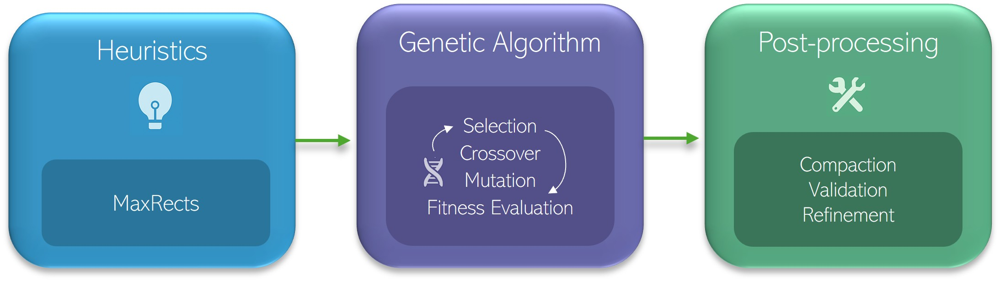
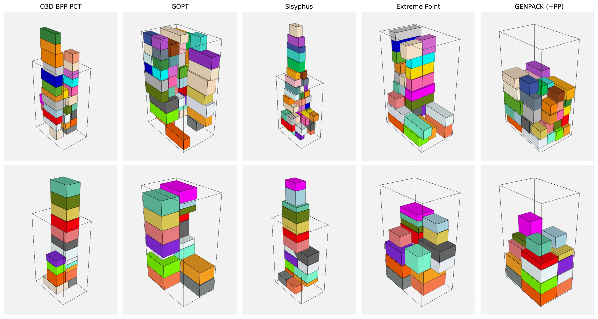

# GENPACK: KPI-Guided Multi-Criteria Genetic Algorithm for Industrial 3D Bin Packing

GENPACK is a research codebase for pallet-oriented 3D bin packing, implementing a KPI-guided multi-criteria optimization pipeline for industrial packing scenarios.

The method combines:

1. Constructive Heuristics (MAXRECTS-based) layer generation
2. Genetic optimization for residual items
3. Optional post-compaction and validation

## Method Overview

### GENPACK Architecture

The pipeline follows a staged optimization strategy:

- MAXRECTS-based constructive phase generates feasible layers
- KPI-guided genetic optimization improves residual placement
- optional post-compaction refines packing quality



---

### Packing Comparison

The optimization stages improve packing density and structure relative to the initial constructive solution.




## Repository Scope

This repository provides:

- the reference Python implementation of GENPACK
- sample input orders in `data/`
- dependency specification (`requirements.txt`)
- scripts to run the pipeline end to end

This repository **does not include** the full industrial evaluation dataset used in the paper; see [bed-bpp-env](https://github.com/floriankagerer/bed-bpp-env) for the industrial dataset reference.
The bundled sample files are sufficient to verify installation and reproduce a full pipeline run.

---

## Reproducibility

This repository contains the public artifact for the GECCO Companion 2026 paper.

Included:

- full implementation of the method described in the paper
- sample data for verification
- commands for end-to-end execution

Not included:

- large-scale evaluation instances

Expected outputs for the sample run:

- `results/packed_items_<order>.csv`
- `results/packed_items_<order>.json`
- optional visualization images

---

## Requirements

- Python 3.9
- pip
- Optional: `vtk` (only required for VTK-based rendering)

---

## Installation

### Core installation

```bash
conda create -n genpack-3d-bpp python=3.9
conda activate genpack-3d-bpp
pip install -r requirements.txt
```

## Quick Start

Run a sample order:

```bash
python -m src.main --ordered-products-path data/1.csv
```

Run with visualization:

```bash
python -m src.main --ordered-products-path data/1.csv --visualize-bins
```

Run with VTK rendering:

```bash
python -m src.main --ordered-products-path data/1.csv --visualize-bins --use-vtk --vtk-resolution 1600x1200
```

---

## Expected Behavior

- The pipeline runs end-to-end using sample data
- Output files are written to the `results/` directory
- Visualization is optional and falls back to matplotlib if VTK is not installed

---

## Input Format

GENPACK expects item dimensions in CSV format.

Required columns:

- `width`
- `length`
- `height`

Recommended:

- `productid` or `id`

Optional:

- `order_id`, `article`, `product_group`, `weight`, `sequence`

---

## Output

Running the pipeline produces:

- `packed_items_<order>.csv`
- `packed_items_<order>.json`
- visualization images (if enabled)

The JSON output preserves item identity and includes `order_id` when available.

---

## Project Layout

```text
genpack-3d-bpp/
|-- src/
|   |-- main.py
|   |-- config.py
|   |-- models/
|   |-- utils/
|-- data/
|-- images/
|-- requirements.txt
|-- CITATION.cff
|-- LICENSE
```

---

## Reproducibility Environment

Tested with:

- Python 3.9
- CPU-only execution

The sample pipeline is lightweight and runs on a standard laptop.

---

## License

This project is released under the license provided in `LICENSE`.

---

## Citation

If you use this code, please cite:

```bibtex
@inproceedings{poolavaram2026genpack,
  author    = {Poolavaram, Dheeraj and Markgraf, Carsten and Dorn, Sebastian},
  title     = {GENPACK: KPI-Guided Multi-Criteria Genetic Algorithm for Industrial 3D Bin Packing},
  booktitle = {Companion Proceedings of the Genetic and Evolutionary Computation Conference (GECCO Companion '26)},
  year      = {2026},
  location  = {San Jose, Costa Rica},
  publisher = {Association for Computing Machinery},
  doi       = {10.1145/3795101.3805272},
  isbn      = {979-8-4007-2488-6/2026/07}
}
```

---

## Notes

- The repository is intended for **research and reproducibility**, not production deployment

---
